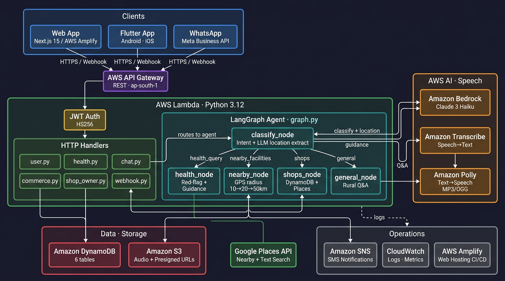
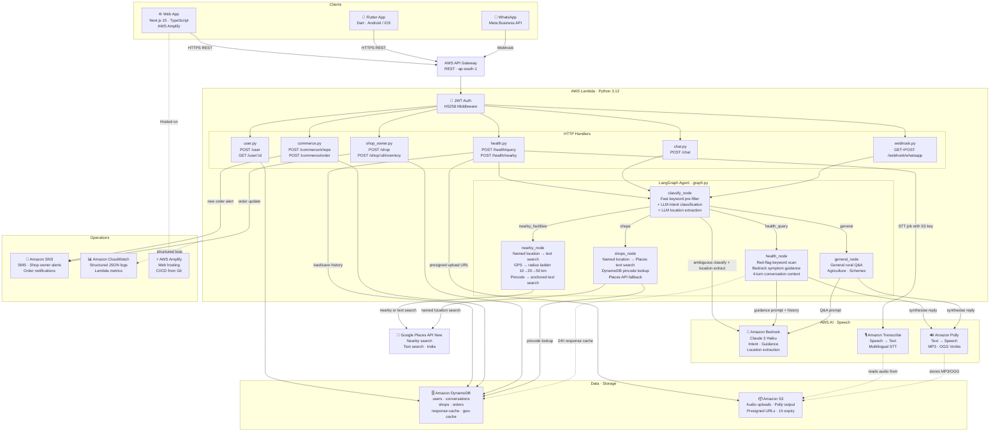

# GramSathi AI

> Voice-first AI assistant for rural India — healthcare guidance, nearby facility discovery, and local commerce.

---

## Overview

GramSathi bridges the gap between rural citizens and essential services through natural voice/text conversations in regional Indian languages. Users can get symptom-based health guidance, find nearby clinics and pharmacies, and order from local shops — all without needing to read or write in English.

---

## Project Structure

```
gram-sathi-ai/
├── backend/          # Python · AWS Lambda · Serverless Framework
├── web/              # Next.js 15 · TypeScript · Tailwind CSS (web client)
├── ui/app/           # Flutter 3.x (Android + iOS mobile client)
└── docs/             # Detailed documentation
    ├── web-ui.md     # Web frontend guide
    ├── backend.md    # Backend architecture & agent design
    └── deployment.md # Deployment instructions
```

---

## Tech Stack

| Layer | Technology |
|---|---|
| Web Frontend | Next.js 15 · TypeScript · Tailwind CSS · Lucide Icons |
| Mobile Frontend | Flutter 3.x (Dart) |
| Backend Runtime | Python 3.12 · AWS Lambda · Serverless Framework |
| AI / LLM | Amazon Bedrock (Claude 3 Haiku) · LangGraph agent |
| Speech-to-Text | Amazon Transcribe |
| Text-to-Speech | Amazon Polly |
| Location Search | Google Places API (New) |
| Database | Amazon DynamoDB |
| File Storage | Amazon S3 |
| Notifications | Amazon SNS |
| Auth | JWT (HS256) |
| Monitoring | Amazon CloudWatch |
| Hosting (Web) | AWS Amplify |

---

## Key Features

### For Users
- **Voice or text input** in Hindi, English, Marathi, Tamil, Telugu, Kannada, Bengali, Gujarati
- **Health guidance** — symptom capture, red-flag detection, non-diagnostic AI response
- **Nearby facilities** — clinics, pharmacies, hospitals found via GPS or user-specified location
- **Local commerce** — shop discovery, assisted ordering, order tracking
- **Audio responses** via Amazon Polly (MP3 default, OGG in low-bandwidth mode)
- **Conversation memory** — 4-turn context window backed by DynamoDB

### For Shop Owners
- Shop registration and profile management
- Inventory upload
- Incoming order notifications (SMS via SNS)
- Daily revenue analytics dashboard

---

## Quick Start

### Backend
```bash
cd backend
python3 -m venv venv && source venv/bin/activate
pip install -r requirements.txt
npm install
cp .env.example .env   # fill in AWS keys, JWT_SECRET, Google Places key
npm run dev            # local serverless-offline
```

### Web App
```bash
cd web
npm install
cp .env.local.example .env.local   # fill in API URL, app URL
npm run dev                         # http://localhost:3000
```

### Flutter App
```bash
cd ui/app
flutter pub get
flutter run --dart-define=API_BASE_URL=https://<your-api>.execute-api.ap-south-1.amazonaws.com/dev
```

See **[docs/deployment.md](docs/deployment.md)** for full production deployment instructions.

---

## Architecture Overview



<details>
<summary>View as Mermaid source</summary>



</details>

> Solid arrows = primary data flow · Dashed arrows = async / side-effect flows

**Location resolution priority:**
1. LLM-extracted location from query (e.g. "clinics in Aklera" → searches Aklera)
2. GPS coordinates from the device/browser (radius ladder: 10 km → 20 km → 50 km)
3. Stored user pincode (text search anchored to pincode)
4. Prompt user for location if none available

---

## Performance

### Latency Benchmarks (Prototype)

| Component | Typical Latency | Notes |
|---|---|---|
| API Gateway + Lambda cold start | ~200 – 400 ms | Warm invocations ~50 ms |
| Bedrock — Claude 3 Haiku | ~1 – 2 sec | Health guidance, intent classification |
| Amazon Transcribe (short audio) | ~2 – 4 sec | 5–15 second voice clips |
| Amazon Polly (TTS synthesis) | ~300 – 600 ms | MP3 · included in AI response time |
| Google Places API lookup | ~300 – 800 ms | Nearby + text search |
| DynamoDB read / write | < 10 ms | Single-item get/put |
| **End-to-end AI response (text)** | **~1.8 – 3.5 sec** | Gateway → Lambda → Bedrock → Polly |
| **End-to-end voice query** | **~4 – 8 sec** | Upload → Transcribe → Bedrock → Polly |

### Scalability

- **Serverless-first** — Lambda scales to thousands of concurrent requests automatically with no infrastructure management
- **DynamoDB on-demand** — capacity scales with traffic; consistent single-digit millisecond reads
- **Stateless processing** — no session state in Lambda; all context stored in DynamoDB per conversation
- **Response caching** — repeated AI queries served from DynamoDB cache (24 h TTL), bypassing Bedrock entirely

### Low-Bandwidth Optimisations

- Audio responses generated **only when requested** (skipped for low-connectivity clients)
- **OGG Vorbis** format available as a smaller alternative to MP3 (Polly low-bandwidth mode)
- Text-first responses always returned alongside audio so the UI is usable without audio playback
- Presigned S3 URLs used for direct client ↔ S3 transfers, keeping Lambda outside the audio data path

---

## API Routes

| Method | Path | Auth | Description |
|---|---|---|---|
| POST | `/user` | — | Register / login, returns JWT |
| GET | `/user/{userId}` | — | Get user profile |
| POST | `/chat` | ✅ | General voice/text → AI reply + audio |
| POST | `/audio/upload-url` | ✅ | Presigned S3 URL for audio upload |
| POST | `/health/query` | ✅ | Symptom → health guidance |
| POST | `/health/nearby` | — | Clinics/pharmacies by location |
| POST | `/commerce/shops` | — | Nearby shops by location |
| POST | `/commerce/order` | ✅ | Place order |
| GET | `/commerce/order/{id}` | ✅ | Order status |
| POST | `/shop` | ✅ | Register shop |
| GET | `/shop/{shopId}` | — | Shop profile |
| POST | `/shop/{shopId}/inventory` | ✅ Owner | Upload inventory |
| GET | `/shop/{shopId}/orders` | ✅ Owner | Incoming orders |
| GET | `/shop/{shopId}/analytics` | ✅ Owner | Daily revenue |
| GET | `/webhook/whatsapp` | — | WhatsApp webhook verify |
| POST | `/webhook/whatsapp` | — | Incoming WhatsApp messages |

---

## Web App Routes

| Route | Description |
|---|---|
| `/` | Login (phone number) |
| `/phone` | OTP / phone verification |
| `/welcome` | Post-login welcome screen |
| `/home` | Main dashboard |
| `/health` | AI health chat |
| `/commerce/shops` | Shop discovery |
| `/commerce/order` | Order placement |
| `/shop/dashboard` | Shop owner dashboard |
| `/shop/inventory` | Inventory management |
| `/legal/privacy-policy` | Privacy policy |

See **[docs/web-ui.md](docs/web-ui.md)** for full UI documentation.

---

## Documentation

| Document | Description |
|---|---|
| [docs/web-ui.md](docs/web-ui.md) | Web frontend — screens, components, state, i18n |
| [docs/backend.md](docs/backend.md) | Backend architecture — agent, services, data models |
| [docs/deployment.md](docs/deployment.md) | Deploy backend, web app, and Flutter app to production |
| [design.md](design.md) | High-level system design |
| [requirements.md](requirements.md) | Product requirements |
| [user-stories.md](user-stories.md) | All 23 user stories |

---

## Tests

```bash
cd backend
source venv/bin/activate
pytest tests/ -v          # 85 tests across 7 suites
```

Test suites:

| File | What it covers |
|---|---|
| `test_auth.py` | JWT issue / verify |
| `test_user_handler.py` | User register / login |
| `test_health_handler.py` | Health query, emergency path, audio flow |
| `test_nearby_features.py` | Google Places routing, radius expansion, LLM location extraction |
| `test_commerce_handler.py` | Shop discovery, order placement |
| `test_shop_owner_handler.py` | Shop registration, inventory, analytics |
| `test_utils.py` | Config, constants, response helpers |

---

## Supported Languages

| Code | Language |
|---|---|
| `hi` | Hindi (default) |
| `en` | English |
| `mr` | Marathi |
| `ta` | Tamil |
| `te` | Telugu |
| `kn` | Kannada |
| `bn` | Bengali |
| `gu` | Gujarati |

---

## Environment Variables

### Backend (`.env`)
| Variable | Description |
|---|---|
| `JWT_SECRET` | Secret for signing JWTs |
| `GOOGLE_PLACES_API_KEY` | Google Places API (New) key |
| `BEDROCK_MODEL_ID` | Bedrock model (default: Claude 3 Haiku) |
| `WHATSAPP_VERIFY_TOKEN` | Meta webhook verify token |
| `WHATSAPP_ACCESS_TOKEN` | Meta Graph API access token |
| `WHATSAPP_PHONE_NUMBER_ID` | Meta phone number ID |
| `WHATSAPP_APP_SECRET` | Meta app secret for signature verification |
| `STAGE` | `dev` or `prod` |
| `AWS_REGION` | AWS region (default: `ap-south-1`) |

### Web App (`.env.local`)
| Variable | Description |
|---|---|
| `NEXT_PUBLIC_API_URL` | Backend API base URL |
| `NEXT_PUBLIC_APP_URL` | Web app public URL (used for canonical URLs) |

---

## License

Private — all rights reserved.
